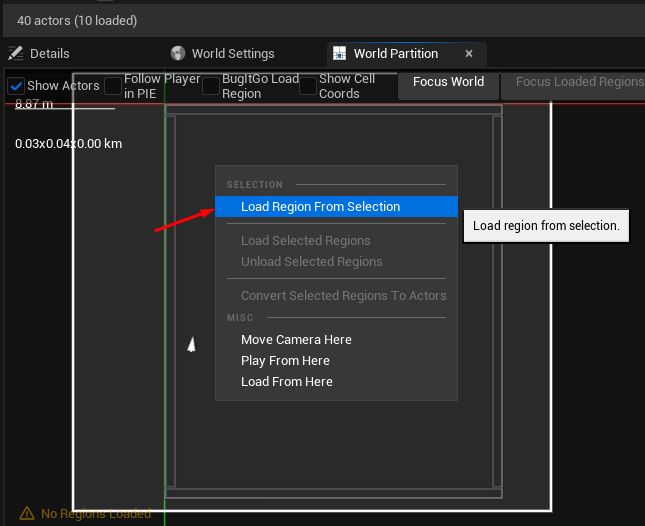
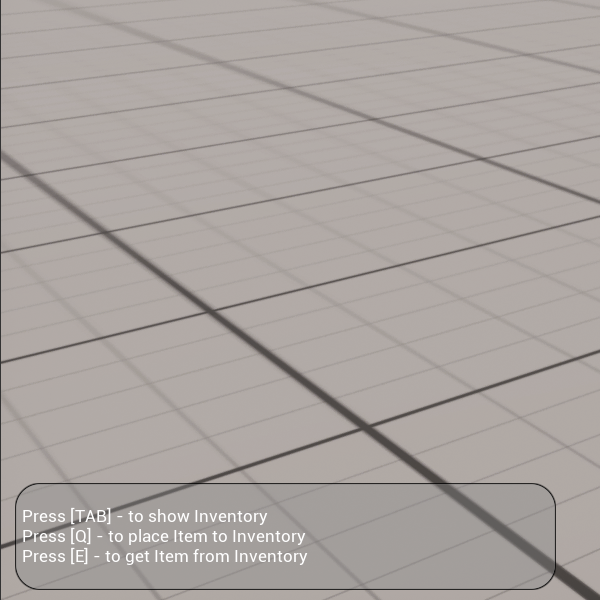
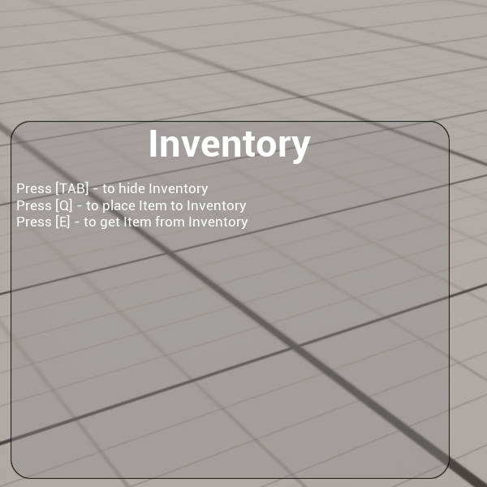
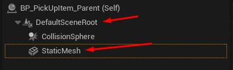
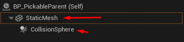
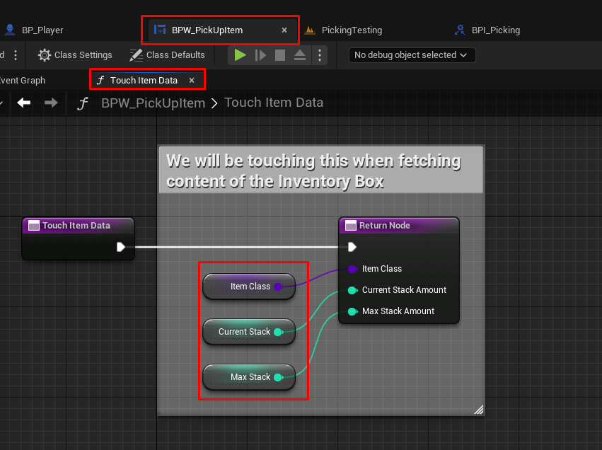

# Items Picker

Після розпакування архіву ItemsPicker.zip та відкриття файлу ItemsPicker.uproject потрібно підвантажити усі об'єкти у ігровому полі:

Після цього ви маєте побачити усі об'єкти.

## 1. Підключити мапінг використання клавіатури.

Створений мапінг для використання клавіатури підключається на початку гри.
У цьому мапінгу розсписано як використовуюєтсья клавіша TAB (посилання на enhanced input що впроваджує зміну показу віджетів),
клавіша Q (посилання на enhanced input що впроваджує під'йом, розміщення у інвентарі та видалення з ігрового поля об'єкта),
клавіша E (посилання на enhanced input що впроваджує видалення однієї позиції об'єкта з інвентаря, та викидання цієї позиції у ігрове поле), клавіша Esc (посилання на enhanced input що впроваджує вихід з гри).

При цьому ігнорується старий підхід щодо 'Engine - Input': 'Axis and Action mappings'.
Це елементарне назначання відповідної клавіши у налаштуваннях проекту з вказівкою за що вона відповідає. В Unreal Engine 5 - так не бажано робити, тому я так не роблю.

## 2. Створити віджети.

Створюється три віджета:

Віджет інвентаря - 'BPW_Inventory'
Віджет інструкції - 'BPW_Instructions'
Іконка стеку інвентаря - 'BPW_PickUpItem'

- 'BPW_Inventory'. Окрім 4 текстових лейблів та кордону з округленними кутами, тут є 'WrapperBox', у його межах будуть створюватись нові віджети об'єктів що зберігаються у інвентарі. 'InventoryBox' позначається як IsVariable - щоб можна було звертатися до нього у блу-принтах.

- 'BPW_Instructions'. Полегшена копія попереднього віджета - де відсутній 'WrapperBox' та лейбл 'Inventory'. Цей віджет тільки дає підказку як використовувати основні клавіши.

- 'BPW_PickUpItem'. Це 'overlay' який розполагається поверх батьківського віджета. Додана кнопка (можна на початку гри підключити функцію вмикання курсора миші для того щоб обирати конкретний предмет у інвентарі натиском курсору, або розробити у майбутньому систему перемикання між позиціями стрілками клавіатури). Додана іконка - вона замальовувається картинкою яка прикріплена до відповідного блу-прінта об'єкта що підіймається (цей процес прводиться у функції 'AddNewStack' у 'BP_Player'). Текст з кількістью об'єктів у стеку. Важливо зазначити що є розміри інвентаря (це кількість стеків що можна розмістити у інвентарі - за замовченням це: 8 у 'BP_Player') та розмір стеку (це максимальна кількість об'єктів одного типу що можна розмістити "один на одному" - для об'єкта 'BP_Ball' цей параметр за замовченням: 3). На початку гри текст не видимий, як тільки у стеку з'явиться другий об'єкт цей текст підсвітиться, як тільки зменшиться до 1 - знову зникне. Елементи ItemIcon, ItemStackSizeText створюються з позначкою IsVariable - для того щоб редагувати їх у майбутньому (з ItemButton можна зробити так само, щоб імплементувати у майбутньому вибір об'єктів у стеку при натисканні мишкою).

  Тут створюються змінні які зберігають ItemClass, MaxStack - вони заповнюються при створенні, а також CurrentStack - оновлюється у випадку додавання або видалення об'єктів.

На рівні 'PickingTesting' - розташовано 25 шарів одного типу. Відповідно у інвентарі можна розмістити 8x3 шари (8 стеків з 3 кульками у кожному) і залишиться тільки один шар, який не буде доданий поки не звільниться місце у стеку.

## 3. Відмалювати віджети.

У події 'Begin Play' створюються віджети для інвентаря та ігрової інструкції.

Але який саме віджет буде демонструватись залежить від клавіши TAB.
На початку гри інвентарь прихований і ми бачимо інструкцію щодо того як підняти та викинути предмет, та як показати інвентарь.

При натисканні клавіши TAB буде продемонстрований інший віджет - інвентарь (де також є інструкція), менший віджет буде схований.

Віджет з іконкою відповідного об'єкту для інвентаря очевидно не потрібно відмальовувати на початку гри. Він буде відмальовуватись у функції 'AddNewStack' - яка викликається якщо ми бачимо поруч об'єкт що можна піднімати, для нього немає місця у якомусь стеку (або жодного стеку немає взагалі) і є місця у інвентарі.

## 4. Додати потрібні змінні до блу-принта гравця.

Гравець - 'BP_Player'.

При створенні віджетів обрати promote to variable - так створити змінні InventoryWidget та InstructionsWidget. Булевська змінна InventoryShowwing - допоможе організувати перемикання між ними при натисканні TAB. У гравці створюється змінна InventoryCapacity - як багато стеків можна створити у інвентарі (по дефолту 8). Далі потрібно буде считувати розмір масива з дітьми у InventoryBox та слідкувати за тим щоб цей параметр не перебільшував InventoryCapacity. Коли буде проводитись пошук доступних для під'ому обє'ктів вони будуть зберігаться у масиві AvailableItems серед яких буде знаходитись NearestItem.

## 5. Створити блу-принти підлоги та об'єктів.

Ігровий об'єкт - 'BP_PickableParent'

Наслідник попереднього блу-принта, шар - 'BP_Ball'

Підлога - 'BP_Floor'

Бажано мати достатньо адекватні об'єкти: такі що можна раптово штовхнути ногою і вони покотяться у сторону, тому для цього вони мають мати у собі увімкненим 'SimulatePhysics' у 'StaticMesh'. Щоб на початку гри об'єкти не провалювались під підлогу - потрібно створити блу-прінт підлоги з 'CollisionBox'. У налаштуваннях 'CollisionBox' обрати пересет 'PhysicsBody' у графі пересети колізій - щоб кульки не провалювались крізь підлогу.

Далі створити батьківський блу-прінт для об'єктів що ми піднімаємо. У наслідуваних блу-прінтах буде відрізнятись іконка (для інвенторя) та максимальна кількість об'єктів у стеку.

Він має: пустий 'StaticMesh' - наслідник перезапише цей компонент своїм не пустим мешем, 'CollisionSphere' - дає можливість "бачати" цей предмет при пошуку через функцію 'GetAllOverlappedActors'.

Тут важливо зазначити про гарний та поганий дизайн розташування цих двох компонентів у дереві.

### Поганий дизайн

Такий дизайн зі 'StaticMesh' під або над 'CollisionSphere' (що не має різниці) - це перше що ви отримаєте після додавання відповідних компонентів. При такому дизайні при звертанні до функції 'GetActorLocation' для відповідної кульки ви будете отримувати координат кулька з її положенням після створення (на початку гри або після 'SpawnActor'). І якщо раптом ви її порухаєте гравець 'BP_Player' перестане з ним перетинятись (при звертанні до функції 'GetAllOverlappedActors' 'CollisionSphere' гравця буде далеко від початкових координат кульки).

### Гарний дизайн

Потрібно перетягнути 'StaticMesh' на позицію DefaultSceneRoot забравши її собі.
Тепер 'CollisionSphere' належить мешу і видає його актуальні координати, а не ті що були після ініціалізації.

У налаштуваннях меша треба обрати пересет 'WorldDynamic' та позначити блокування 'PhysicsBody' та 'WorldDynamic' - щоб не перетинятись з тілом гравця що рухається та не провалюватись під підлого.

Саме 'CollisionSphere' відповідає за знайдення об'єкту та передачу його координат - тому тут для всіх об'єктів обрати Overlap.

Створити змінні у батьківському блу-принті: 'ItemClass' - у наслідуванному блу-принті вказати який клас він представляє, 'ItemIcon' - у наслідуванному блу-принті обрати картинку іконки для інвентаря, 'StackSize' - також вказується у наслідуванному блу-принті.

## 6. Створити інтерфейс блу-принти для комунікації між блу-принтами гравця, ігрового об'єкту та іконки стеку інвентаря.

Після натискання клавіші Q буде згенерований сигнал OpenInventory - який отримає відповідний найближчий об'єкт. Він має запевнетись що до нього звертається гравець, а не інший ігровий об'єкт і після цього ігровий об'єкт пакує презентабельну інформацію та надсилає її сигналом GetItemData.

Event GetItemData: Гравець має отримати презентабельну інформацію (клас, іконка та розмір стеку) від ігрового об'єкту.

При цьому гравець надсилає сигнали: TouchItemData - зчитати актуальний стан іконки (клас, актуальна кількість об'єктів у стеку, максимальна кількість). І якщо для нового об'єкту знайшлось місце у існуючому стеку - об'єкт буде доданий туди сигналом AddItemToStack (який отримає іконка).

У випадку якщо у існуючому стеку місця не знайшлось буде перевірено чи не заповнений інвентарь і якщо ще є місце для нового стеку, то він буде створений.
У останньому випадку об'єкт у ігровому полі буде знищенний.

Event DropItem: Відповісти на сигнал про скидання об'єкту з інвентаря (сигнал іде від іконки) - створити новий об'єкт (з відповідноми координатами та поворотом) та відправити сигнал до ігрового об'єкту PushItemAway: де у батьківському класі вже прописано як буде додаватись імпульс до ного об'єкту.

Після натисканні клавіші E буде отриманий доступ до останньої іконки у стеку (у майбутньому можна буде організувати вибір іконок клавішами клавіатури або мишкою) та відправити сигнал до іконки стеку TakeFromInventory.
Event TakeFromInventory: буде згенерований сигнал про скидання об'єкту відповідного класу DropItem. У цьому ж івенті лічильник буде зменшений та оновиться на іконці, або сама іконка буде знищена якщо це був останній об'єкт.

Відповідно можна рознести сигнали по різним блу-принтам:

BPI_Keyboard - OpenInventory та TakeFromInventory генеруютсья безпосередньо після натискання відповідних клавіш на клавіатурі, що отримується у 'BP_Player' та надсилаються далі.

BPI_Picking - GetItemData, DropItem, TouchItemData, AddItemToStack та PushItemAway це безпосередньо обмін данними між блупринтами.

## 7. Організувати ігровий процес.

**Event graph у BP_Player:**

Потрібно дослідити щоб в процесі гри всі сигнали та події мали адекватну послідовність, також бажано у правильний момент забрати у гравця можливість керувати грою поки обрабляється ігрове поли з пошуком нового об'єкта, щоб вберегти від завчасного скидання, та іншого.

_Event Enhanced IA_InventoryShowHide:_

- Перше натискання - інвентарь показується, на наступному ховаєтсья і так далі.

_Event Enhanced IA_PickUpStuff:_

- Натискається клавіша Q та вимикається можливість керування грою у гравця.
- Гравець зупиняється.
- TouchAllAvailableItems: зчитати всі OverlappedActors та додати унікальні що є наслідниками класу BP_PickableParent до пустого масиву. Якщо після аналізу масив залишився пустим віддати грацію керування. Можна буде очікувати поки гравець знову не натисне клавішу Q.
- GetNearestItem: зважаємо на те що всі об'єкти мають бути в межах 'CollisionSphere', тому її радіус можна використати при пошуку найближчого об'єкта. Для кожного об'єкту у масиві можна порахувати відстань до гравця, оновити цю відстань якщо вона менше попередньої та перезаписати змінну з посиланням до найближчого об'єкту.
- Якщо не знайшлось адекватного близького об'єкту (бо ми відсіяли всі не ігрові об'єкти які могли потрапити до масиву).
- Надсилаємо сигнал OpenInventory до батьківського класу об'єкту, який спакує для нас інформацію про цей об'єкт.

_Event GetItemData:_

- Спочатку перевірити чи відповідний об'єкт запрограмований на стекування. Ми можемо створювати такі об'єкти які будуть займати собою цілий стек (відповідно розмір стеку у них дорівнює одиницею).
- Якщо об'єкт стекується, то перевірити чи не має для нього місця у існуючих стеках. Тут нам знадобиться змінна InventoryWidget, яка дасть нам доступн до змінної InventoryBox з якої ми візьмемо масив існуючих стеків до кожного з яких будемо надсилати сигнал TouchItemData.

- Звіряємо клас піддослідного класу з класом у віджеті, якщо є співпадіння - перевіряємо чи є для нього місце у стеку, якщо є місце - надсилаємо сигнал AddItemToStack.

У блу-принті BPW_PickUpItem потрібно реалізувати сигнал TouchItemData - з'єднавши всі данні іконки.

_Event AddItemToStack (BPW_PickUpItem):_

Збільшується лічильник у стеку, оновлюється текстовий лейбл, за необхідністю встановлюється видимість тексту.

Далі знову **Event graph у BP_Player:**

- Якщо місце знайшлось - знищити об'єкт у ігровому полі. Віддати контроль гравцю.

- Якщо місця у стеку не знайшлось, або якщо об'єкт не стекується - потрібно перевірити чи є взагалі місце у інвентарі для нового стеку. Якщо є то створюється новий стек, знищується об'єкт у ігровому полі та повертається контроль гравцеві.

- Якщо у інвентарі немає місця для нового стеку, то об'єкт **не знищується** та повертається контроль гравцеві.

_Event Enhanced IA_GrabStuff:_

- Після натисканні клавіші E беремо останній віджит у масиві віджетів з InventoryBox. Якщо такий віджет знайшовся то генеруємо сигнал TakeFromInventory.
  Якщо немає, то жодної гра ніяк не реагує - інвентарь пустий.

_Event TakeFromInventory (BPW_PickUpItem):_

- Пакується інформація про клас що буде звільнятись з інвентаря та генерується сигнал DropItem для BP_Player.

- Декременується стек. Якщо він дорівнює після цього нулю - віджет знищується.

- Якщо ще залишився хочаб один об'єкт у стеку - потрібно перевірити чи ми показуємо текстовий лейбл (якщо об'єкт один у стек ми не показуємо лейбл). Також оновлюємо кількість вказану у текстовому лейблі.

Далі знову **Event graph у BP_Player:**

_Event DropItem:_

- У полі генерується об'єкт з відповідним положенням та оборотом.

- Генерується сигнал PushItemAway для батьківського класу об'єкта BP_PickableParent.

_Event PushItemAway (BP_PickableParent):_

- Розраховується початковий імпульс для новостворенного об'єкту. Це додасть реалістичності при скиданні об'єкту.

_Event Enhanced IA_Quit:_

- Коли користувач натисне Escape закриється декстопне вікно з грою (цей функціонал розроблений для експортовання гри на PC: Windows, Linux).

## Можна насолоджуватись грою.

